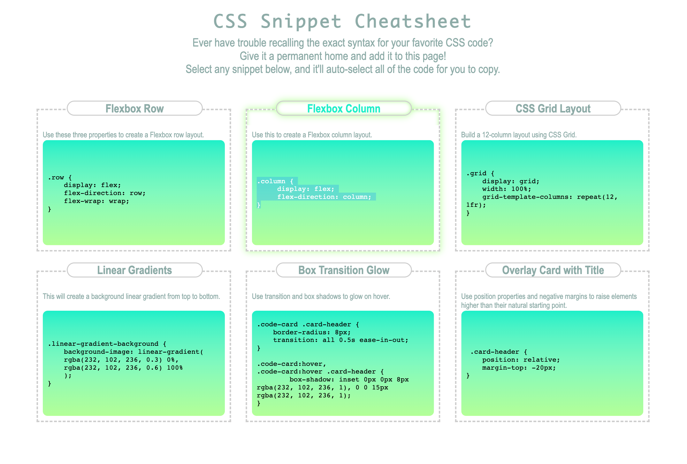

# CSS Snippet

## Description

Sometimes, it can be difficult to find specific CSS code to add specific designs or styles to your page. Thus, i was motivated to provide an easy-to-access guide for quick snippets of CSS code for any developer to use.

This quick snippets page provides code syntax for making flexbox rows and columns, CSS grid layouts, linear gradients, box transition glows, and overlays of cards with titles.

While making this, I learned how to make parts of a webpage glow, how to have one click automatically highlight all the text in a given space, as well as different ways to use positioning and flexbox to size certain parts in relation to other elements of the page.

## Usage

You can click on any snippet of CSS code, and it will automatically be highlighted for you to copy and paste as you please.
The corresponding card you are hovering over will grow green to help ensure you are aware of what code card you are on.

Please see the following screenshot for an example.

In this example, user clicked on the code desired, and the entire code was highlighted, with no need to drag the cursor throughout in order to highlight. Simply copy & paste to your desire.

## Credits

Thank you to A. Bradshaw of BCS Support who was very helpful in figuring out how to have the box of code syntax (linear green gradient) fill out to the bottom of its container.

